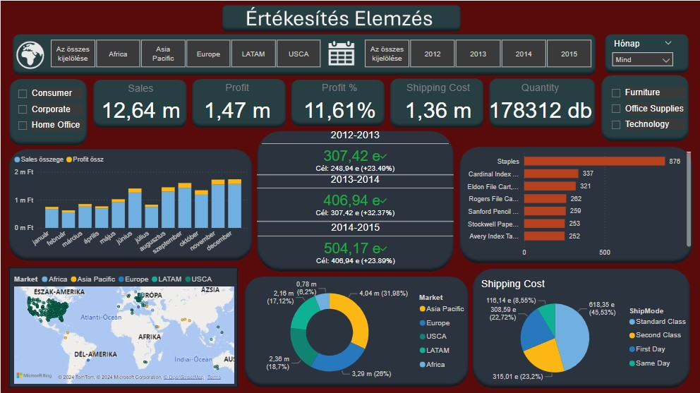
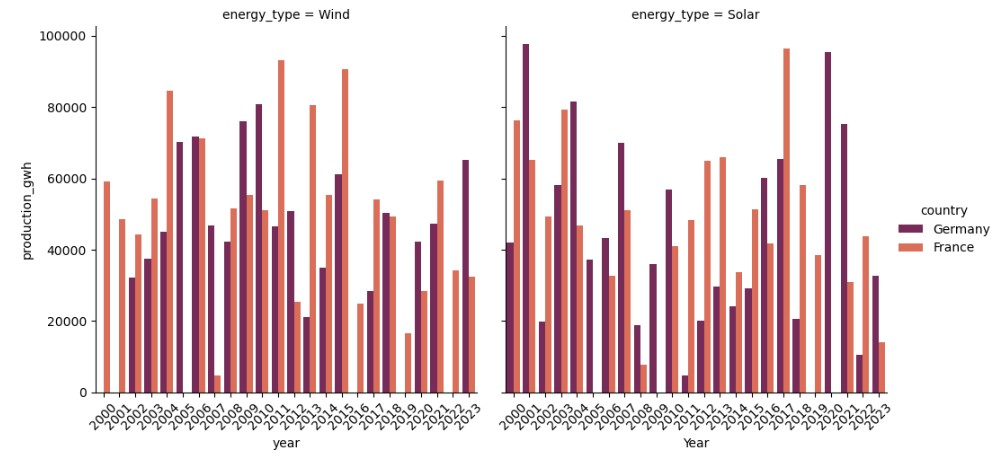
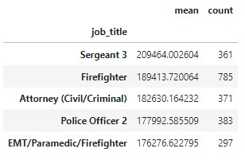
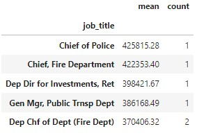

# Bevezetés
**Egyetemi kurzusaim során tanult készségeim gyakorlása, illetve tovább fejlesztése céljából készítettem az alábbi projekteket.**
# [Power BI Projekt](https://github.com/rfanni324/power-bi-project)
### Az adatokól: 
Az adatokat egyetemi tanárom adta. Az adatbázis tisztítást excel power pivot-ban végeztem. Itt számoltam a KPI-okat és egyeb adatokat is, de volt amivel ki kellett egészítenem Power BI-ban.

# Data Analysis Projektek
### *Jupyter Notebook használatával*
## [Újrahasznosítható energia](https://github.com/rfanni324/energy-p1)
### Az adatokól: 
Az adatok [kaggle-ről](https://www.kaggle.com/datasets/anishvijay/global-renewable-energy-and-indicators-dataset/data) vannak. Az adatbázis tisztítását pythonban csináltam.
## Munkamenet:

## [Fizetések](https://github.com/rfanni324/salaries-p2)
### Az adatokól: 
Az adatokat egyetemi tanárom adta.
## Munkamenet:

